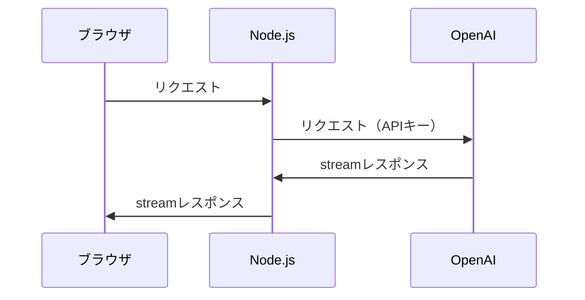

ChatGPTでは、全ての回答の生成を待たずに、回答が順次画面に表示されていきます。


実は、OpenAIのChat APIを使う場合も、同じ挙動を実現できます。

**アプリの例**


# 方法1. ブラウザで直接OpenAI APIを叩く

以下の記事で紹介されているように、ブラウザのFetch APIを使って直接OpenAIの APIを叩く方法が一番シンプルにできそうです。

https://zenn.dev/himanushi/articles/99579cf407c30b

注意点として、**APIキーがユーザーに知られる**ため、ユースケースが限られそうです。

# 方法2. Node.jsのサーバーを介してOpenAI APIを叩く

今回は、以下のように中間にNode.jsのサーバーを挟む例を示します。



## Step1. Node.jsサーバーの実装

※注意点として、サーバーは `text/event-stream` 形式のレスポンスを返す必要があり、 Next.js API Routes + VercelやAWS Amplifyのような、サーバーレス環境では、筆者が試した限りでは実現できませんでした。

https://github.com/vercel/next.js/issues/9965

そのため、Express.jsなどのサーバーが必要になります。

### ライブラリ

- openai 3.2.1
- express 4.18.2

### Step1-1. OpenAI API呼び出し

まず、OpenAI APIからの返答を少しずつ受け取るジェネレータ関数を定義します。

```ts:backend/streamChatCompletion.ts
import { IncomingMessage } from "http";
import { Configuration, OpenAIApi } from "openai";

const API_KEY = process.env.OPEN_AI_API_KEY!;
const openai = new OpenAIApi(new Configuration({ apiKey: API_KEY }));

type RequestParams = {
  model: string;
  messages: { role: "user" | "system" | "assistant"; content: string }[];
};

export async function* streamChatCompletion(params: RequestParams) {
  const response = await openai.createChatCompletion(
    {
      ...params,
      stream: true,
    },
    {
      responseType: "stream",
    }
  );

  const stream = response.data as unknown as IncomingMessage;
  for await (const chunk of stream) {
    const lines: string[] = chunk
      .toString("utf8")
      .split("\n")
      .filter((line: string) => line.trim().startsWith("data: "));

    for (const line of lines) {
      const message = line.replace(/^data: /, "");
      if (message === "[DONE]") {
        return;
      }

      const json = JSON.parse(message);
      const token: string | undefined = json.choices[0].delta.content;
      if (token) {
        yield token;
      }
    }
  }
}
```

**ポイント**

- openaiライブラリ自体に `stream: true` というパラメータが用意されているがこれだけでは使えず、 `responseType: "stream"` というaxiosのオプションが必要
- :::details 以下のようにtokenごとに渡ってくるchunkから、contentのみを取り出してyieldする
  `chunk.toString("utf8")` の例
  ```log
  data: {"id":"chatcmpl-XXXXX","object":"chat.completion.chunk","created":1680323732,"model":"gpt-3.5-turbo-0301","choices":[{"delta":{"role":"assistant"},"index":0,"finish_reason":null}]}

  data: {"id":"chatcmpl-XXXXX","object":"chat.completion.chunk","created":1680323732,"model":"gpt-3.5-turbo-0301","choices":[{"delta":{"content":"Hello"},"index":0,"finish_reason":null}]}


  data: {"id":"chatcmpl-XXXXX","object":"chat.completion.chunk","created":1680323732,"model":"gpt-3.5-turbo-0301","choices":[{"delta":{"content":" there"},"index":0,"finish_reason":null}]}


  data: {"id":"chatcmpl-XXXXX","object":"chat.completion.chunk","created":1680323732,"model":"gpt-3.5-turbo-0301","choices":[{"delta":{"content":"!"},"index":0,"finish_reason":null}]}


  data: {"id":"chatcmpl-XXXXX","object":"chat.completion.chunk","created":1680323732,"model":"gpt-3.5-turbo-0301","choices":[{"delta":{"content":" How"},"index":0,"finish_reason":null}]}


  data: {"id":"chatcmpl-XXXXX","object":"chat.completion.chunk","created":1680323732,"model":"gpt-3.5-turbo-0301","choices":[{"delta":{"content":" may"},"index":0,"finish_reason":null}]}


  data: {"id":"chatcmpl-XXXXX","object":"chat.completion.chunk","created":1680323732,"model":"gpt-3.5-turbo-0301","choices":[{"delta":{"content":" I"},"index":0,"finish_reason":null}]}


  data: {"id":"chatcmpl-XXXXX","object":"chat.completion.chunk","created":1680323732,"model":"gpt-3.5-turbo-0301","choices":[{"delta":{"content":" assist"},"index":0,"finish_reason":null}]}


  data: {"id":"chatcmpl-XXXXX","object":"chat.completion.chunk","created":1680323732,"model":"gpt-3.5-turbo-0301","choices":[{"delta":{"content":" you"},"index":0,"finish_reason":null}]}


  data: {"id":"chatcmpl-XXXXX","object":"chat.completion.chunk","created":1680323732,"model":"gpt-3.5-turbo-0301","choices":[{"delta":{"content":" today"},"index":0,"finish_reason":null}]}


  data: {"id":"chatcmpl-XXXXX","object":"chat.completion.chunk","created":1680323732,"model":"gpt-3.5-turbo-0301","choices":[{"delta":{"content":"?"},"index":0,"finish_reason":null}]}


  data: {"id":"chatcmpl-XXXXX","object":"chat.completion.chunk","created":1680323732,"model":"gpt-3.5-turbo-0301","choices":[{"delta":{},"index":0,"finish_reason":"stop"}]}

  data: [DONE]


  ```

  tokenとして返される値
  ```log
  "Hello"
  " there"
  "!"
  " How"
  " may"
  " I"
  " assist"
  " you"
  " today"
  "?"
  ```
  :::

https://github.com/openai/openai-node/issues/18

### Step1-2. Expressのエンドポイント実装

以下のようなエンドポイントで、streamChatCompletionで得られたtokenをstreamingしていきます。

```ts:backend/index.ts
import express from "express";
import { streamChatCompletion } from "./streamChatCompletion";

const app = express();
app.use(express.json());

app.post('/api/stream_chat_completion', async (req: express.Request, res: express.Response) => {
  res.setHeader("Content-Type", "text/event-stream;charset=utf-8");
  res.setHeader("Cache-Control", "no-cache, no-transform");
  res.setHeader("X-Accel-Buffering", "no");

  try {
    for await (const data of streamChatCompletion(req.body)) {
      res.write(data);
    }
  } catch (e) {
    return res.status(500).send({ message: "Internal server error" });
  }
  res.end();
})

const port = process.env.PORT || 3000;
app.listen(port);

console.log("Express WebApi listening on port " + port);
```

（その他適宜CORS対応などが必要です）

## Step2. クライアント側の実装

### Step2-1. 上記のAPIを呼び出すジェネレータ関数を定義

```ts:frontend/streamChatCompletion.ts
type RequestParams = {
  model: string;
  messages: { role: "user" | "system" | "assistant"; content: string }[];
};

export async function* streamChatCompletion(params: RequestParams) {
  const completion = await fetch(
    `${process.env.NEXT_PUBLIC_API_BASE_URL}/api/stream_chat_completion`,
    {
      headers: {
        "Content-Type": "application/json",
      },
      method: "POST",
      body: JSON.stringify(params),
    }
  );

  const reader = completion.body?.getReader();

  if (completion.status !== 200 || !reader) {
    throw new Error("Request failed");
  }

  const decoder = new TextDecoder("utf-8");
  let done = false;
  while (!done) {
    const { done: readDone, value } = await reader.read();
    if (readDone) {
      done = readDone;
      reader.releaseLock();
    } else {
      const token = decoder.decode(value, { stream: true });
      yield token;
    }
  }
}
```

### Step2-2. ジェネレータ関数を呼び出す

```ts:frontend/index.ts
import { streamChatCompletion } from "./streamChatCompletion";

const main = async () => {
  const generator = streamChatCompletion({
    model: "gpt-3.5-turbo",
    messages: [{ role: "user", content: "hi" }],
  });
  for await (let token of generator) {
    console.log(token);
  }
};

main()
```

実行結果: 以下が徐々に出力されます。

```log
"Hello"
" there"
"!"
" How"
" may"
" I"
" assist"
" you"
" today"
"?"
```

# 終わりに

他の方の記事やGithubのコメントを参考に何とか動くようにした程度の理解度ですので、おかしな点がありましたらご指摘ください🙏

#### 改善案

サーバーからのレスポンスにtokenしか含まれておらず、modelなどの情報が失われてしまっているので、サーバーからはAPIからのレスポンスをそのまま返し、クライアント側でパースするのも良さそうです。

#### 参考リポジトリ

ご参考までに、本記事の方法で実装したChatGPT模倣アプリです。

https://github.com/K-kind/my-gpt-plus
